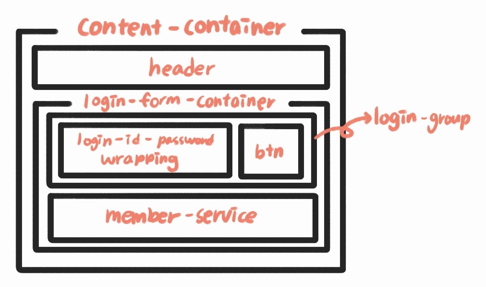

# 🧩Mission - 02
position과 float를 활용하여 webCafe의 로그인 화면 구현
  

## ✔ 완성된 UI
***

  

## ✔ 설명
***
__HTML 구조__

* content-container로 모든 컨텐츠 감싸기
* header로 제목 추가
* login-form-container로 모든 요소 감싸기
* login-group로 아이디/비밀번호 입력창, 로그인 버튼 묶기
* login-id-password-wrapping으로 아이디/비밀번호 input 묶기
* member-service로 회원가입, 아이디 비밀번호 찾기 묶기
  

__CSS 코드__

* box-shadow를 사용해 content-container에 그림자 생성
* form 태그를 사용하여 로그인 기능 구현
* legend 태그의 내용은 숨김 처리
* fieldset 태그로 생기는 border 없애기
* login-group 내의 input, button 요소는 position을 사용하여 정렬
* login-group에서 border-bottom으로 밑줄 효과 주기
* login-id-password-wrapping 내의 label과 input 요소도 position을 사용하여 정렬
* member-service 내의 span 요소는 float를 사용하여 정렬
* ::before를 사용해 span 앞쪽에 꺽쇠 삽입
* 박스 위쪽과 오른쪽에 border를 주고 45도 회전시켜 꺽쇠 만들기
  

## ✔ 아쉬운 점
***

* div를 너무 많이 사용한 것 같다.
* width 값을 div마다 줬는데 비효율적인 느낌이어서 다음에는 더 효율적인 방법을 찾고싶다.
* README를 이렇게 쓰는게 맞는지 모르겠다.