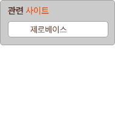
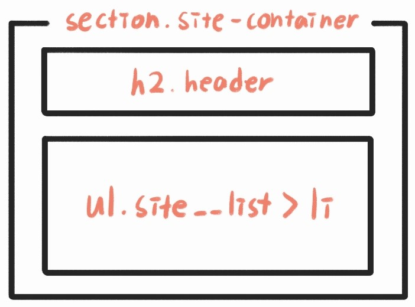

# 💞Mission - 03
transition을 활용한 webCafe의 관련 사이트 section 구현
<br><br>

## ✔ 완성된 UI

<br><br>

## ✔ 설명
__HTML 구조__



* section태그로 독립된 컨텐츠임을 알려줌
* h2 태그로 제목 삽입
  * 텍스트에 부분적으로 색을 입히기 위해 span 태그를 사용
* ul 태그로 사이트 목록 만들기
* li 요소에 a 태그를 삽입하여 링크로 만들기
<br><br>

__CSS 코드__

* site-container 스타일 지정
  * hight값은 움직임에 따라 자동으로 바뀌도록 하기 위해 지정하지 않음
  ```CSS
  .site-container {
    width: 11.875rem;
    padding: 0.5rem 0.75rem 0.75rem;
    box-sizing: border-box;
    background-color: #ccc;
    border: 1px solid #A3A3A3;
    border-radius: 5px;
  }
  ```
* header 스타일 지정
  ```CSS
  .header {
    font-size: 0.9375rem;
    font-weight: 700;
    margin-bottom: 0.5rem;
  }

  .header span {
    font-size: inherit;
    color: #ED552F;
  }
  ```
* ul 초기 스타일 지정
  * overflow: hidden<br> 박스에 담기지 않는 li요소는 숨김 처리
  * transition: all 300ms ease-out<br> 모든 요소의 변화를 0,3초 동안 전환, ease-out은 움직임 부드럽게 하기 위해 삽입
  ```CSS
  .site__list {
    width: 10.375rem;
    height: 1.6875rem;
    padding: 0.0625rem 2rem;
    box-sizing: border-box;
    background-color: #fff;
    border: 1px solid #A3A3A3;
    border-radius: 5px;
    list-style: none;
    overflow: hidden;
    transition: all 300ms ease-out;
  }
  ```
* 마우스 오버 했을 때, ul의 height를 조절해 펼쳐지는 움직임 주기
  ```CSS
  .site__list:hover {
    height: 9.0625rem;
  }
  ```
* ul 내의 li요소들이 한 박자 늦게 내려가는 움직임 주기
  * li의 첫번째 요소의 padding-top 속성을 조절해 움직임 주기
  * transition-delay: 400ms<br> 0.4초 뒤에 동작하도록 하기 위해서 삽입
  ```CSS
  .site__list:hover li:first-child {
    padding-top: 0.875rem;
    transition: all 300ms ease-out;
    transition-delay: 400ms;
  }
  ```
* li 초기 스타일 지정
  * 마우스 호버가 끝났을 때의 움직임 주기
  ```CSS
  .site__list li {
    padding: 0.25rem;
    transition: all 300ms ease-out;
    transition-delay: 400ms;
  }
  ```
<br>

## ✔ 아쉬운 점
* site-container에 height를 설정해서 transition이 동작하지 않았는데 이유를 몰라서 많이 헤맸다.
* 여전히 README를 이렇게 쓰는게 맞는지 잘 모르겠다.
