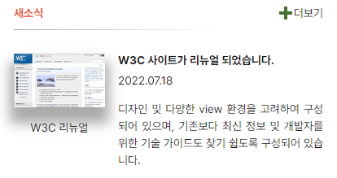
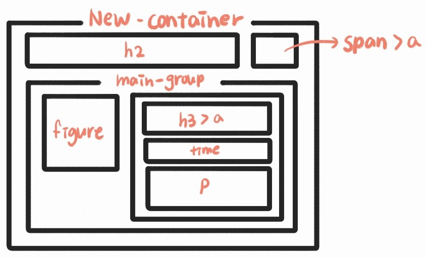
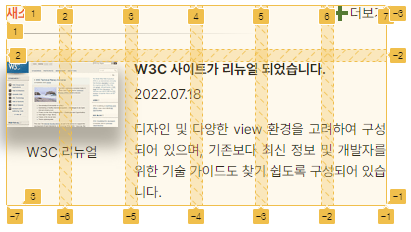
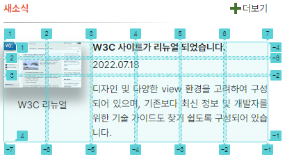

# 📰Mission - 03
grid을 활용한 webCafe의 관련 사이트 section 구현
<br><br>

## ✔ 완성된 UI

<br><br>

## ✔ 설명
__HTML 구조__



* section 태그로 독립된 컨텐츠임을 알려줌
* h2 태그로 콘텐츠의 제목 삽입
* 메인 콘텐츠를 main-group이라는 div 태그로 감싸기
  * 이미지는 figure 태그를 사용
  * 메인 콘텐츠의 제목은 h3 태그를 사용하여 삽입, a태그로 링크를 걸어줌
  * 메인 콘텐츠의 날짜는 time 태그를 사용하여 날짜임을 알려줌
  * 메인 콘텐츠의 본문은 p 태그를 사용하여 하나의 블록으로 만들기
* 더보기는 메인 콘텐츠를 모두 읽은 후 나타나야하는 요소라고 생각하여 메인 콘텐츠 아래에 배치, a태그로 링크를 걸어줌
<br><br>

__CSS 코드__

* new-container 스타일 지정
  * grid를 사용하여 header부분과 main-group의 레이아웃을 설정
  * 6column 사용
  * grid-template-areas로 위치 지정
  * heading은 h2, more은 더보기, main은 main-group을 뜻함<br>

  ```CSS
  .new-container {
    gap: 12px;
    width: 23.75rem;
    height: 12.5rem;
    display: grid;
    grid-template-columns: repeat(6, 1fr);
    grid-template-rows: auto;
    grid-template-areas: 
    "heading heading heading heading heading more"
    "main main main main main main"
  }
  ```
* border 생성 및 스타일 지정
  * header::after를 사용
  * border-bottom으로 아랫쪽에 border 생성
  * border-image를 사용해 border에 그라디언트 삽입
  ```CSS
  .header::after {
    content: "";
    display: block;
    width: 80%;
    margin-top: 0.75rem;
    margin-bottom: 0.75rem;
    border-bottom: 1px solid;
    border-image: linear-gradient(90deg, #A9A9A9 -1.32%, #FFFFFF 100%)1;
  }
  ```
* 더보기 스타일 지정
  * justify-self의 값을 end로 지정해 자신의 grid 내에서 글자를 정렬
  * 더하기 기호 생성
    * before, after를 사용해 두 개의 상자 생성
    * after의 상자를 90도로 회전시켜 + 기호로 보이게끔 지정
    * position을 활용해 위치 지정
  ```CSS
  .more {
    grid-area: more;
    justify-self: end;
    position: relative;
  }
  
  .more::before, .more::after {
    position: absolute;
    content: ' ';
    left: -0.75rem; 
    height: 1rem;
    width: 0.25rem;
    background-color: #447231;
  }

  .more::after {
    transform: rotate(90deg);
    top: 0;
  }
  ```
* main-group 스타일 지정
  * grid를 사용하여 이미지와 본문의 레이아웃을 설정
  * 6column 사용
  * image는 figure, title은 h3, date는 time, content는 p를 뜻함<br>
  
  ```CSS
  .main-group {
    grid-area: main;
    gap: 0.25rem;
    width: inherit;
    display: grid;
    grid-template-columns: repeat(6, 1fr);
    grid-template-rows: 1.3125rem 1.3125rem auto;
    grid-template-areas: 
    "image image title title title title"
    "image image date date date date"
    "image image content content content content";
  }
  ```
* 이미지 스타일 지정
  * box-shadow를 사용해 이미지에 그림자 생성
  ```CSS
  .main__img img {
    width: 7rem;
    height: 4.125rem;
    box-shadow: 0 15px 15px 5px #AAAAAA;
    margin-left: -0.75rem;
  }
  ```
* 본문 스타일 지정
  * text-align: justify로 문단을 양쪽 정렬
  ```CSS
  .main__content {
    grid-area: content;
    margin-top: 0.5rem;
    line-height: 150%;
    text-align: justify;
  }
  ```
<br>

## ✔ 아쉬운 점
* 마크업을 진행할 때 순서에 대해서 더 많은 생각을 해봐야 할 것 같다.
* border에 그라디언트를 넣을 때 사용한 border-image에서 slice 속성을 완벽히 이해하지 못했다.
* 반복적으로 사용되는 값을 변수로 지정하는 것을 시도해봐야겠다.