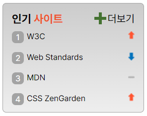

# 🖼Mission - 05
grid을 활용한 webCafe의 관련 사이트 section 구현
<br><br>

## ✔ 완성된 UI

<br><br>

## ✔ 설명
__HTML 구조__


* section 태그로 독립된 컨텐츠임을 알려줌
* h2 태그로 콘텐츠의 제목 삽입
* 메인 콘텐츠를 favorite-rank라는 클래스를 가진 ol 태그로 감싸기
  * ol에 aria-label="인기사이트 순위"를 넣어 콘텐츠의 내용을 알려줌
  * 순위를 보여주는 그림은 sprite기법을 사용하여 보여줌
  * li에 aria-label로 순위를 알려줌
* 더보기는 메인 콘텐츠를 모두 읽은 후 나타나야하는 요소라고 생각하여 메인 콘텐츠 아래에 마크업, a태그로 링크를 걸어줌
<br><br>

__CSS 코드__

* favorite-container 스타일 지정
  * flex 컨테이너로 변경, 방향을 column으로 지정
  ```CSS
  .favorite-container {
    display: flex;
    flex-flow: column nowrap;
    position: relative;
  }
  ```
* h2 스타일 변경
  * 사이트 글자를 span요소로 감싸 color 변경
  ```CSS
  .favorite-title span {
    color: #ED552F;
  }
  ```
* ol 스타일 변경
  * flex 컨테이너로 변경, 방향을 column으로 지정
  * space-between을 사용하여 리스트 간격을 동일하게 펼치기
  * conter의 이름을 rank로 설정, 초기값을 0으로 설정
  ```CSS
  .favorite-rank {
    display: flex;
    flex-direction: column;
    justify-content: space-between;
    list-style: none;
    counter-reset: rank;
  }
  ```
* li marker 스타일 변경
  * counter를 사용하여 숫자 삽입
    * counter-increment로 rank의 숫자를 1씩 증가
    * counter 함수로 rank의 카운터 값 표시
  * text-align과 line-height를 사용해 상자와 숫자를 정렬
  * li와 li::before에 position을 설정해 inline 때문에 크기가 적용되지 않는 상자를 정상적으로 출력
  ```CSS
  .favorite-rank li {
    position: relative;
  }

  .favorite-rank li::before{
    counter-increment: rank;
    content: counter(rank);
    width: 1rem;
    height: 1rem;
    color: #fff;
    background: #A3A3A3;
    border-radius: 5px;
    text-align: center;
    line-height: 16px;
    position: absolute;
  }

  .favorite-rank a {
    margin-left: 1.25rem;
  }
  ```
* sprite 이미지 출력
  * sprite 이미지를 출력하기 위해서 background에 이미지 삽입
  * 화살표 모양별로 포지션 지정
    * 오른쪽 정렬을 위해 x축 위치는 100%로 지정
    * 필요한 이미지별로 y축 위치 지정
  ```CSS
  .sprite {
    background: url(./images/rank.png) no-repeat;
  }

  .spriteUp {
    background-position: 100% 0;
  }

  .spriteNo {
    background-position: 100% -20.5px;
  }

  .spriteDown {
    background-position: 100% -44px;
  }
  ```
* 더보기 스타일 지정
  * justify-self의 값을 end로 지정해 자신의 grid 내에서 글자를 정렬
  * 더하기 기호 생성
    * before, after를 사용해 두 개의 상자 생성
    * after의 상자를 90도로 회전시켜 + 기호로 보이게끔 지정
    * position을 활용해 위치 지정
  ```CSS
  .more {
    grid-area: more;
    justify-self: end;
    position: relative;
  }
  
  .more::before, .more::after {
    position: absolute;
    content: ' ';
    left: -0.75rem; 
    height: 1rem;
    width: 0.25rem;
    background-color: #447231;
  }

  .more::after {
    transform: rotate(90deg);
    top: 0;
  }
  ```
<br>

## ✔ 생각해 볼 점
* li marker를 지정할 때 나는 position을 사용했지만 before 요소를 inline-block으로 지정하는 간단한 방법이 있었다. 속성을 줄 때 왜 안되는지, 기본 스타일이 어떤지 좀 더 깊이 생각할 필요가 있다.
* aria-label로 어떤 정보를 제공해줘야 하는지 생각해보자.